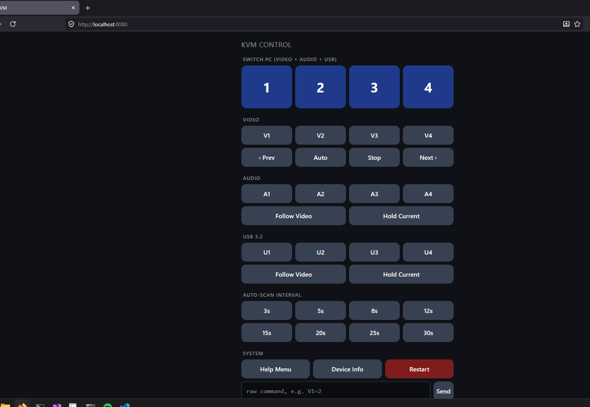

# Controlling a Level1Techs KVM easily and remotely

I bought a [Level1Techs HDMI 2.1 KVM](https://www.store.level1techs.com/products/p/hdmi-21-kvm-wedid-serial-control-dual-monitor-four-computer) because I want to use my same monitor/keyboard mouse setup across four different computers for various different projects. It's a great box — 4K@120, real USB 3.2, no perceptible input lag (even for gaming). I love it with the control+control+number hotkey. So I can switch to another computer easily. I used it so much I even broke the control key on one of my keyboards.

So I wanted to explore what else I could do with it, specially over the MGMT port I've been ignoring for a few years.

The manual barely mentions it, you have to build a special [cable](https://www.store.level1techs.com/products/p/cisco-cat6-rj-45-to-rj-11-adapter) to use it. It turns out you can do a lot with it. You can decide /what/ to change, rather than changing everything at once. Like if I want to check how a build is going on another machine without dropping all your USB devices on the floor and then having Windows pick them back up (it can take like 15 seconds depending on the device).

 It turns out it speaks a small ASCII command protocol — `V=2` switches video to PC 2, `A=3` switches audio, that kind of thing. If I could talk to that port, I could switch the KVM from anywhere scriped or from a web page. So I wrote [Level1TechKVMControl](https://github.com/guscatalano/Level1TechKVMControl) to test to see what I could do.

## What it is

Three PowerShell scripts:

- **`kvm.ps1`** — a CLI and REPL for one-off commands (`./kvm.ps1 -PC 2`) or interactive use.
- **`kvm-server.ps1`** — holds the serial port open and serves a phone-friendly web UI on your LAN.
- **`probe-kvm-serial.ps1`** — a brute-force discovery script for figuring out what the firmware actually accepts (more on this below).

Everything's a single file, no dependencies beyond PowerShell 7 and an RS-232 USB adapter with the special cable.

## Getting it running

You need an special CAT6 RJ45 to RJ11 ([this kind of cable](https://www.store.level1techs.com/products/p/cisco-cat6-rj-45-to-rj-11-adapter)) as well as a [RJ45 to USB](https://www.amazon.com/dp/B01AFNBC3K) adapter. Plug it into the back of the KVM, plug the USB end into your machine, and check Device Manager for the COM port number. The scripts default to `COM5`; pass `-Port COM3` if yours is different.

Then:

```powershell
git clone https://github.com/guscatalano/Level1TechKVMControl
cd Level1TechKVMControl

# Switch video + audio + USB all to PC 2
./kvm.ps1 -PC 2

# Or drop into the REPL and just type "2"
./kvm.ps1
```

The REPL is the one I use day-to-day — single keystrokes for the common stuff:

```
> 1            switch everything to PC 1
> v3           video only to PC 3
> a2 u2        audio and USB to PC 2 (leave video alone)
> next / prev  cycle active video ports
> scan / stop  start / stop auto-scan
```

## Phone control

`kvm-server.ps1` is where it gets fun. It binds the serial port and serves a simple web page:

```powershell
./kvm-server.ps1
```

It prints every LAN IP it can find:

```
KVM web UI is up. Open from this PC or anything on your LAN:
  http://localhost:8080/
  http://192.168.1.42:8080/
```

Open that on your phone, bookmark to home screen, and you have a permanent four-button remote in your pocket. Big PC 1/2/3/4 buttons up top, per-lane (video / audio / USB) pickers below, auto-scan controls, raw command escape hatch. No auth — don't run it on a guest network.



## Limitations
I could not figure out how to switch /both/ monitors like the hot key does, this only switches the primary monitor.

## Aside: how I figured out the protocol

The fun part. The manual lists a handful of commands but it's somewhat incomplete — features in the web admin had no documented serial equivalents. So I wrote a probe.

`./kvm.ps1 -Probe` walks the keyspace: single letters, `X=value`, `XN=M`, common identifiers, and sends each one to the serial port. The KVM helpfully replies `>` for accepted commands and `<` for rejected ones, which makes it trivial to classify. ~3 minutes for the standard probe, ~9 for `-DeepProbe` (adds all two-letter combos), ~80 for `-FullProbe` (every three-letter combo).

```powershell
# Standard probe — ~3 min
./kvm.ps1 -Probe

# Deeper — ~9 min, every two-letter combo
./kvm.ps1 -DeepProbe
```

Two things made this safe enough to run on a live KVM:

1. **Restart and factory-reset commands are hard-excluded.** Anything matching `H=R` or `FAC` never gets sent, even if you ask for it. Otherwise the probe would brick its own run halfway through.
2. **You have to be okay with your monitors switching around for a few minutes.** Every time the probe lands on a valid command, you'll see it happen on your displays. There's no way around this — the device doesn't have a dry-run mode — but it's harmless.

The probe is how I learned the KVM has commands I didn't know existed: per-lane "follow video" vs "hold current" toggles, auto-scan interval steps, a help menu (`?`), a device-info command (`K=3`). All of those ended up as REPL shortcuts and UI buttons.

If you have a totally different KVM that speaks ASCII over RS-232, there's a chance the probe approach works for you too — clone it, swap the safety regex for your device's reset command, run it.

## Where to find it

- **Repo:** [github.com/guscatalano/Level1TechKVMControl](https://github.com/guscatalano/Level1TechKVMControl)
- **Issues / suggestions welcome** — especially if your KVM revision speaks slightly different commands than mine.

If this saved you from lifting a monitor, [coffee is appreciated ☕](https://ko-fi.com/guscatalano).
